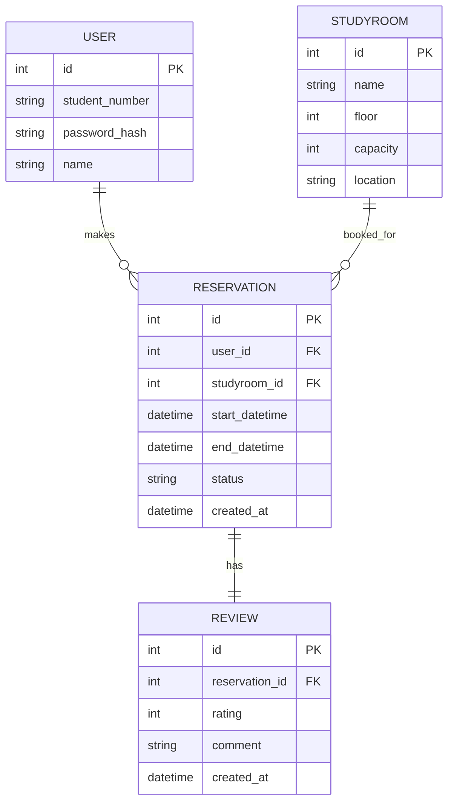

```mermaid
erDiagram
    USER ||--o{ RESERVATION : makes
    STUDYROOM ||--o{ RESERVATION : booked_for
    RESERVATION ||--|| REVIEW : has

    USER {
        int id PK
        string student_number
        string password_hash
        string name
    }

    STUDYROOM {
        int id PK
        string name
        int floor
        int capacity
        string location
    }

    RESERVATION {
        int id PK
        int user_id FK
        int studyroom_id FK
        datetime start_datetime
        datetime end_datetime
        string status
        datetime created_at
    }

    REVIEW {
        int id PK
        int reservation_id FK
        int rating
        string comment
        datetime created_at
    }
```

